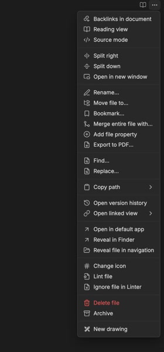
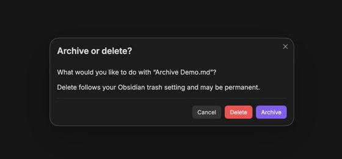

# Integrated Archive

Integrated Archive moves files out of active work without treating them as disposable.

<p align="center">
  
  
</p>

## Features

- **Archive current file** command and optional file-menu action.
- Choose whether Delete asks each time, archives automatically, or uses Obsidian’s normal delete flow.
- The optional prompt offers **Archive / Delete / Cancel**. Delete follows your configured Obsidian trash setting and may be permanent.
- Configurable archive folder with optional original folder structure.
- Optional archive tag and archived, created, and last-edited frontmatter dates.
- Collision-safe names such as `note (1).md`; existing files are never overwritten.
- Files already inside the archive use Obsidian's normal delete flow.

## Use

Right-click a file and select **Archive**, or run **Integrated Archive: Archive current file** from the command palette. Configure the folder, delete prompt, tag, property names, folder structure, and date format under **Settings → Integrated Archive**.

The plugin works locally inside your vault. It has no network access, accounts, telemetry, or external services.

## Install for development

```sh
bun install
bun run build
```

Copy `manifest.json` and `main.js` into:

```text
<vault>/.obsidian/plugins/integrated-archive/
```

Then enable **Integrated Archive** under **Settings → Community plugins**.

Run `bun run dev` while developing and `bun run check` before committing.

## Release

Keep the version in `package.json`, `manifest.json`, and `versions.json` in sync, then push a tag with that exact version and no `v` prefix:

```sh
git tag 0.1.0
git push origin 0.1.0
```

GitHub Actions verifies the version, builds the plugin, and creates a release containing the files Obsidian needs.

## License

[MIT](LICENSE)
